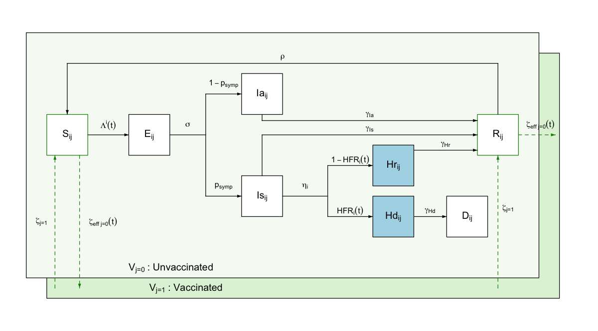

<!-- README.md is generated from README.Rmd. Please edit that file -->

```{r, include = FALSE}
knitr::opts_chunk$set(
  collapse = TRUE,
  comment = "#>",
  fig.path = "man/figures/README-",
  out.width = "100%"
)
```

# daedalus: Model health, social, and economic costs of a pandemic

<!-- badges: start -->
[](https://www.repostatus.org/#concept)
[](https://github.com/jameel-institute/daedalus/actions/workflows/R-CMD-check.yaml)
[](https://app.codecov.io/gh/jameel-institute/daedalus?branch=main)
[](https://CRAN.R-project.org/package=daedalus)
<!-- badges: end -->

_daedalus_ implements an integrated epidemiological and economic model based on @haw2022, to help project the health and economic outcomes of directly transmitted respiratory epidemics and the measures taken to mitigate them, including restrictions on economic activity, vaccination campaigns, and changes in public behaviour.



## Installation

You can install the development version of daedalus from the [Jameel Institute R-universe](https://jameel-institute.r-universe.dev/builds), or from this repository using the _pak_ package.

```r
if(!require("pak")) install.packages("pak")
pak::pak("jameel-institute/daedalus", upgrade = FALSE)

# installation from R-universe
install.packages(
  "daedalus", 
  repos = c(
    "https://jameel-institute.r-universe.dev", "https://cloud.r-project.org"
  )
)
```

### Installation notes

_daedalus_ is under active development. To use a version of _daedalus_ associated with major milestones, install a specific version from the list below.

- IDM Thailand 2024 (R-only version): `pak::pak("jameel-institute/daedalus@v0.1.0")`

- IfG workshop 2025 (with real time modelling): `pak::pak("jameel-institute/daedalus@v0.2.0")`

### Known issues

We have found the following issues with released versions:

1. `v0.1.0`: Consumer-worker contacts are not correctly handled, leading to higher and faster epidemic peaks.

2. `v0.2.0`: Consumer-worker contacts are not included in the model, leading to lower and later epidemic peaks. The 'recovered' compartment does not include recoveries from hospitalisation. Please use the helper function `get_epidemic_summary()` to get epidemic sizes.

## Graphical dashboard

_daedalus_ powers the graphical pandemic projections dashboard, [Daedalus Explore](https://daedalus.jameel-institute.org/), which allows users to try out the Daedalus model without having to write any code.

## Quick start

The model can be run for any country or territory in the `country_names` list by passing the country name to the function.
This automatically pulls country-specific demographic and economic data, which is included in the package, into the model (see the ['Get started' vignette](https://jameel-institute.github.io/daedalus/articles/daedalus.html) for more details).

```{r libraries}
library(daedalus)

# run model for Canada
output <- daedalus("Canada", "influenza_1918")

# view the output
output

# get pandemic costs as a total in million dollars
get_costs(output, "total")

# disaggregate total for economic, education, and health costs
get_costs(output, "domain")
```

## Customising model parameters

 - **Selecting historical epidemic parameters**: Users can select infection parameters from among seven epidemics caused by directly-transmitted viral respiratory pathogens, which are stored in the stand-alone helper package [_daedalus.data_](https://jameel-institute.github.io/daedalus.data/). These can be called as `daedalus.data::infection_data`, while epidemic identifiers are stored as `daedalus.data::epidemic_names`.

 - **Custom country and infection parameters**: Users can override default country contact data and epidemic-specific infection arguments by passing custom classes to `daedalus()`; see the [package website for more details](https://jameel-institute.github.io/daedalus/reference/index.html).

 - **Modelling pandemic mitigation measures**: Users can also model the implementation of pandemic response measures: for more on this see the documentation for the [main model function `daedalus()`](https://jameel-institute.github.io/daedalus/reference/daedalus.html), and the [vignette on modelling interventions on the package website](https://jameel-institute.github.io/daedalus/articles/thresholded_response.html).

 - **Modelling parameter uncertainty**: _daedalus_ provides the `daedalus_multi_infection()` function to easily model outcomes for multiple sets of epidemic parameters, which can be used to model outcomes under parameter uncertainty; see the [vignette on modelling parameter uncertainty for more](https://jameel-institute.github.io/daedalus/articles/infection_parameter_uncertainty.html).

## Related projects

_daedalus_ is an R implementation of an epidemic projections model based on @haw2022 and on a [project on the economics of pandemic preparedness](https://github.com/robj411/p2_drivers).

- [_daedalus.data_](https://github.com/jameel-institute/daedalus.data) is a stand-alone helper R package to handle input data for the _daedalus_ model. Its purpose is to allow users to flexibly manipulate or change epidemiological and economic data, without needing to modify the model itself.

- [_daedalus.compare_](https://github.com/jameel-institute/daedalus.compare) is an R package that sits both downstream of _daedalus_ and also wraps some _daedalus_ functions to help users conveniently run multiple epidemic scenarios.

- [_daedalus.api_](https://github.com/jameel-institute/daedalus.data) is an R package that connects _daedalus_ with the [DAEDALUS Explore](https://daedalus.jameel-institute.org/) dashboard.

## Help

To report a bug, request a feature, or just start a discussion, [please open an issue](https://github.com/jameel-institute/daedalus/issues/new).

## References
