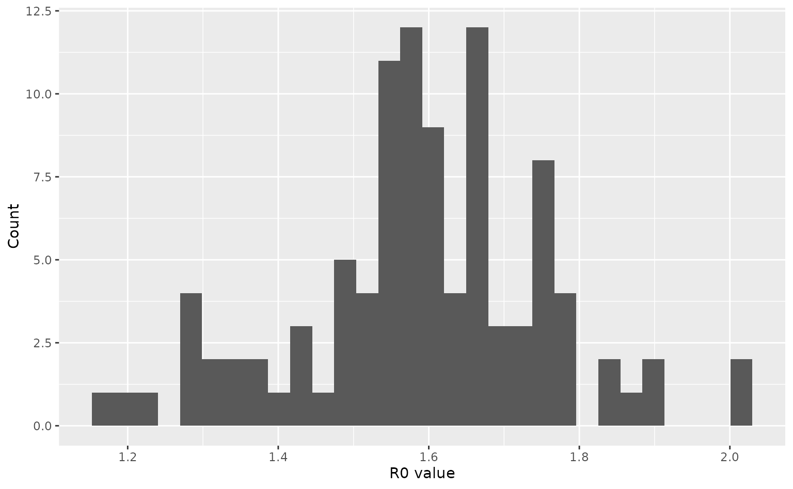

# Modelling outcomes under uncertainty in infection parameters

This vignette shows how to use *daedalus* to model outcomes under
uncertainty in infection parameters. We focus on uncertainty in \\R_0\\,
which has a major effect on epidemic trajectories.

Load required packages including *daedalus*.

``` r
library(daedalus)
library(ggplot2)
library(dplyr)
#> 
#> Attaching package: 'dplyr'
#> The following objects are masked from 'package:stats':
#> 
#>     filter, lag
#> The following objects are masked from 'package:base':
#> 
#>     intersect, setdiff, setequal, union
```

Consider an infection similar to 2009 influenza, with uncertainty in the
\\R_0\\. We draw a set of 100 \\R_0\\ values from a normal distribution
to parameterise 100 `<daedalus_infection>` objects, which can be passed
as a list to the function \[daedalus_multi_infection()\].

``` r
flu_2009 <- daedalus_infection("influenza_2009")
flu_2009_r0 <- get_data(flu_2009, "r0")

# draw samples
r0_samples <- flu_2009_r0 * stats::rnorm(100, 1, 0.1)

# view a histogram of samples
ggplot() +
  geom_histogram(aes(r0_samples)) +
  labs(
    x = "R0 value",
    y = "Count"
  )
#> `stat_bin()` using `bins = 30`. Pick better value `binwidth`.
```



``` r

# parameterise daedalus_infection objects
infection_list <- lapply(
  r0_samples, \(x) daedalus_infection("influenza_2009", r0 = x)
)
```

Run the model for the U.K. with the infection list passed as
`infection`. No mitigation strategies are applied.

``` r
# run model with 100 infection objects
output_list <- daedalus_multi_infection(
  "GBR", infection_list,
  time_end = 100
)

# get incidence data and plot epi curves
data_list <- lapply(output_list, get_incidence, "infections")
data_list <- Map(
  data_list, seq_along(data_list),
  f = function(df, i) {
    df$param_set <- i
    df
  }
)
data <- bind_rows(data_list)

# plot curves
ggplot(data) +
  geom_line(
    aes(time, value, group = param_set),
    alpha = 0.4
  ) +
  labs(x = "Time", y = "New infections")
```


