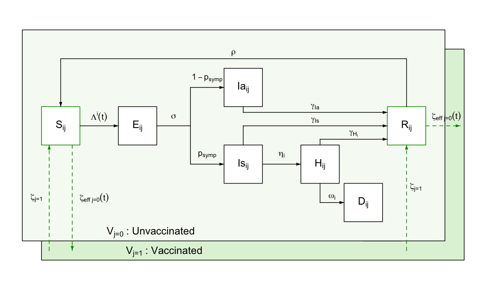

# General model description

This vignette presents a technical description of the *daedalus* model
in its current state. It should be noted *daedalus* is in constant
development; we will attempt to keep this document as updated as
possible during the lifespan of the model. If you encounter any issues,
contact the package developers or raise a GitHub issue.

## Rationale

The *daedalus* package is the implementation of a deterministic
epidemiological and economic model of the emergence and spread of
respiratory pathogen pandemics in countries. Specifically, *daedalus*
tracks

- Health impact in terms of infections, hospitalisations, deaths and
  years of life lost (YLL), and

- Economic impact in terms of GDP losses from:

  - Economic sector closures and workforce depletion due to infection,
    hospitalisation or death
  - Present and life-time economic losses from missed education
  - Human life losses using the value of statistical life approach

Presently, we have equipped *daedalus* with parameters to simulate seven
potential pathogens (influenza A 2009, influenza A 1957, influenza A
1918, SARS-CoV-1, SARS-CoV-2 pre-Alpha variant, SARS-CoV-2 Delta and
SARS-CoV-2 Omicron BA.1, see [this table on pathogen
parameters](#pathogendata)) across 67 countries. In addition, *daedalus*
allows the user the flexibility to incorporate additional respiratory
pathogen and/or country parameters and data, as considered appropriate
for their use case.

The following sections present a technical description of the
epidemiological and economic components of *daedalus*. For examples of
its implementation in research case studies, see

- The original description of *daedalus* and application to the UK
  during the COVID-19 pandemic in Haw et al. ([2022](#ref-haw2022))

- Study of the societal value of SARS-CoV-2 booster vaccination in
  Indonesia in Johnson et al. ([2023](#ref-johnson_indonesia))

- Study of promoting healthy populations as a pandemic preparedness
  strategy in Mexico in Johnson et al. ([2024](#ref-johnson_mexico))

## Epidemiological model

### Model structure

*daedalus* simulates a country’s population split into seven possible
disease state compartments. Model compartments are stratified by
age-sector sector \\i\\ and vaccination \\j\\ classes.

A susceptible individual \\S\\ can become exposed to the virus and enter
a latent state \\E\\, from which they can develop either a symptomatic
\\I_s\\ or asymptomatic \\I_a\\ infection. Whereas asymptomatic infected
individuals are assumed to always recover, symptomatic ones can either
recover \\R\\ or develop a more severe condition requiring
hospitalisation that would lead to either recovery \\H_r\\ or death
\\H_d\\. We assume different lengths of hospital stay for this
compartments, after which individuals transition to the recovered \\R\\
or death \\D\\ compartments.

#### Ordinary differential equations

\\ \begin{aligned} & \frac{dS\_{i,j}}{dt} = \zeta\_{eff\_{j=0}}(t)
S\_{i,j=0}(t) - \Lambda\_{i,j} (t) S\_{i,j}(t) + \rho R\_{i,j}(t) -
\zeta\_{j=1} S\_{i,j=1}(t)\\ & \frac{dE\_{i,j}}{dt} = \Lambda\_{i,j} (t)
S\_{i,j}(t) - \sigma E\_{i,j}(t) \\ & \frac{dIa\_{i,j}}{dt} = (1 -
p\_\text{symp}) \sigma E\_{i,j}(t) - \gamma\_{I_a} I\_{a\_{i,j}}(t) \\ &
\frac{dIs\_{i,j}}{dt} = p\_\text{symp} \sigma E\_{i,j}(t) -
\gamma\_{I_s} I\_{s\_{i,j}}(t) - \eta^i I\_{s\_{i,j}}(t) \\ &
\frac{dHr\_{i,j}}{dt} = \eta^i (1 - \text{HFR}\_{i}) I\_{s\_{i,j}}(t) -
\gamma\_{H_r} H\_{r\_{i,j}}(t) \\ & \frac{dHd\_{i,j}}{dt} = \eta^i
\text{HFR}\_{i} I\_{s\_{i,j}}(t) - \gamma\_{H_d} H\_{d\_{i,j}}(t) \\ &
\frac{dR\_{i,j}}{dt} = \zeta\_{eff\_{j=0}}(t) R\_{i,j=0}(t) +
\gamma\_{I_s} I\_{s\_{i,j}}(t) + \gamma\_{Ia} Ia\_{i,j}(t) +
\gamma\_{Hr} Hr\_{i,j}(t) - \rho R\_{i,j}(t) - \zeta\_{j=1}
R\_{i,j=1}(t)\\ & \frac{dD\_{i,j}}{dt} = \gamma\_{Hd} Hd\_{i,j}(t)\\
\end{aligned} \\

Should be noted that whilst some model parameters vary over time (e.g.,
\\\zeta\_{eff\_{j=0}}(t)\\ effective vaccination rate scaled for
available susceptible population) others are assumed fixed (e.g.,
\\\sigma\\ constant rate of \\E \rightarrow I\\ progression), which is
indicated by \\(t)\\.

One parameter that varies endogenously is the age-specific mortality
rate \\\omega^i\\; mortality rates for all groups increased by 160% when
the total number of individuals in the ‘hospitalised’ compartment
exceeds the country-specific surge hospital capacity available for
responding to the outbreak.

**Note that**, as default, *daedalus* ships a collection of pre-defined
parameter sets that represent historical respiratory pandemic pathogens
(see [this table on pathogen parameters](#pathogendata)), as contained
in *daedalus.data*. These can be saved as an object of class
`daedalus_infection` and modified by the user to be then passed to the
model function \[daedalus::daedalus()\].

#### Age-sector classes

There are 49 age-sector classes \\i\\ in *daedalus*: four age \\i \in
1:4\\ groups \\(\[0, 5), \[5, 20), \[20-65), 65+)\\ and, given
population in \\i=3\\ (20–64 years old) represents unemployed adults ofr
working age, 45 economic groups \\i \in 5:49\\ (see in the [section on
the *economic model*](#econ-model) below).

#### Vaccination classes

As a default, *daedalus* further disaggregates the population into the
vaccination classes \\j \in 1:2\\ of unvaccinated and vaccinated. We
assume only the population in the susceptible and recovered compartments
can be vaccinated, given transition rate
\\\zeta\_{\text{eff}\_{j=0}}(t)\\, which is determined by the user (see
this [table on vaccination scenario parameters](#vaccine)). Vaccinated
individuals can lose their immunity and transition back to an
unvaccinated class, given rate \\\rho\\.

### Model transition parameters

*daedalus* can simulate nine different pathogens (influenza A 2009,
influenza A 1957, influenza A 1918, SARS-CoV-1, SARS-CoV-2 pre-Alpha
variant, SARS-CoV-2 Delta and SARS-CoV-2 Omicron BA.1) with
pathogen-specific transition (see [this table on pathogen
parameters](#pathogendata)).

| **Parameter**              | **Definition**                                                              |
|:---------------------------|:----------------------------------------------------------------------------|
| \\\Lambda\_{i,j} (t)\\     | Force of infection by age-sector and vaccination class                      |
| \\\sigma\\                 | Rate of progression from exposed to infectious                              |
| \\p\_\text{symp}\\         | Proportion of exposed individuals becoming symptomatic                      |
| \\\eta^i\\                 | Probability of hospitalisation by age, conditional on symptomatic infection |
| \\\gamma\_{Ia}\\           | Recovery rate for asymptomatic infections                                   |
| \\\gamma\_{Is}\\           | Recovery rate for symptomatic infections                                    |
| \\\gamma\_{Hr}\\           | Recovery rate for hospitalised individuals                                  |
| \\\gamma\_{Hd}\\           | Death rate for hospitalised individuals                                     |
| \\\rho\\                   | Rate of waning immunity (recovered to susceptible)                          |
| \\\zeta\_{eff\_{j=0}}(t)\\ | Vaccination rate                                                            |
| \\\zeta\_{j=1}\\           | Vaccine protection waning rate                                              |

Table: Definition of model transition parameters.

#### Seed and force of infection

For any given pathogen, we assume a seed of \\10^{-7}\\ infections, all
of which are further assumed to be symptomatic.

The force of infection \\\lambda\_{i,j} (t)\\ accounts for the infection
contributions of symptomatically \\I\_{s\_{ij}}(t)\\ and
asymptomatically \\I\_{a\_{ij}}(t)\\ infected individuals in the
community and in workplaces.

We let \\\delta I\_{\text{comm}}^i(t)\\ and \\\delta
I\_{\text{work}}^i(t)\\ denote the number of infected individuals in the
community and the workplace, respectively, weighted by their infectivity
given

\\ \begin{aligned} & \delta I\_{\text{comm}\_{ij}}(t) = v\_{eff\_{j=1}}
(I\_{a\_{i \in 1:4,j}}(t) \epsilon + I\_{s\_{i \in 1:4,j}}(t))\\ &
\delta I\_{\text{work}\_{ij}}(t) = v\_{eff\_{j=1}} (I\_{a\_{i \in
5:49,j}}(t) \epsilon + I\_{s\_{i \in 5:49,j}}(t)) \end{aligned} \\

where \\\epsilon\\ is the relative infectiousness of an asymptomatically
infected individual relative to a symptomatic one, and
\\v\_{\text{eff}\_{j=1}}\\ the reduced susceptibility of a vaccinated
individual relative to an unvaccinated one of the same age.

The force of infection from the community
\\\lambda\_{\text{comm}\_{i,j}} (t)\\ on a susceptible individual is
thus modelled as

\\ \lambda\_{\text{comm}\_{i,j}} (t) = \beta (t) \cdot \sum\_{i'}
m\_{i,i'} \sum\_{j'} \delta I\_{{\text{comm}}\_{i',j'}} (t) \\

where \\\beta(t)\\ represents a time-varying contact rate scaling
factor, determined by social distancing interventions simulated, and
\\m\_{i,i'}\\ is the (symmetric) person-to-person contact rate between
age group \\i\\ and \\i'\\.

The force of infection within the workplace \\\lambda\_{work\_{i,j}}
(t)\\ is modelled as

\\ \lambda\_{\text{work}\_{i,j}} (t) = \beta (t) \cdot \Phi_i(t) \cdot
\sum\_{i'=0}^{i'=N} C\_{i,i'} \sum\_{j'} \delta
I\_{\text{work}\_{i',j'}} (t) \\

where \\C\_{i,i'}\\ is a contact matrix specific to the workplace, and
\\\Phi_i(t)\\ is a scaling factor determined by economic closure
interventions simulated.

Lastly, the force of infection from infected individuals in the
community to susceptible workers
\\\lambda\_{\text{comm}\rightarrow\text{workers}\_{i,j}} (t)\\ (i.e.,
infected individuals from the community attending shops) is given by

\\ \lambda\_{\text{comm}\rightarrow\text{workers}\_{i,j}} (t) = \beta
(t) \cdot \Phi_i(t) \cdot \sum\_{i'=0}^{i'=N} {C \rightarrow W}\_{i,i'}
\sum\_{j'} \delta I\_{{\text{comm}}\_{i',j'}} (t) \\

where \\C \rightarrow W\_{i,i'}\\ is a contact matrix specific to
consumers attending workplaces.

The total force of infection acting on susceptible individuals is then
assumed to be an addition of the above. For conciseness, this can be
taken as

\\ \Lambda\_{ij} (t) = \lambda\_{\text{comm}\_{ij}} (t) +
\lambda\_{\text{work}\_{ij}} (t) +
\lambda\_{\text{comm}\rightarrow\text{workers}\_{i,j}} (t) \\

however, it should be noted that the force of infection within the
workplace \\\lambda\_{work\_{ij}} (t)\\ is a column vector of length 45,
given the number of economic sector classes in the model, whilst
\\\lambda\_{\text{comm}\_{ij}} (t)\\ and
\\\lambda\_{\text{comm}\rightarrow\text{workers}\_{i,j}} (t)\\ are of
length 49, encompassing all age-sector classes.

#### Disease transition rates

| **Parameter**                                                                               | **Symbol**            | **Influenza 2009** | **Influenza 1957** | **Influenza 1918** | **Covid Omicron** | **Covid Delta** | **Covid Wild-type** |
|:--------------------------------------------------------------------------------------------|:----------------------|:-------------------|:-------------------|:-------------------|:------------------|:----------------|:--------------------|
| Basic reproduction number                                                                   | \\R_0\\               | 1.58               | 1.80               | 2.50               | 5.94              | 5.08            | 2.87                |
| Probability symptomatic                                                                     | \\p\_{\text{sympt}}\\ | 0.669              | 0.669              | 0.669              | 0.592             | 0.595           | 0.595               |
| Relative infectiousness (asymptomatic:symptomatic)                                          | \\\epsilon\\          | 0.58               | 0.58               | 0.58               | 0.58              | 0.58            | 0.58                |
| Latent period (days)                                                                        | \\1/\sigma\\          | 1.1                | 1.1                | 1.1                | 4                 | 4               | 4.6                 |
| Infectious period asymptomatic (days)                                                       | \\1/\gamma\_{Ia}\\    | 2.5                | 2.5                | 2.5                | 2.1               | 2.1             | 2.1                 |
| Infectious period symptomatic (days)                                                        | \\1/\gamma\_{Is}\\    | 2.5                | 2.5                | 2.5                | 4                 | 4               | 4                   |
| Infection-induced immune period (days)                                                      | \\1/\rho\\            | 365                | 365                | 365                | 365               | 365             | 365                 |
| Length of hospital stay leading to recovery (days)                                          | \\1/\gamma\_{Hr}\\    | 5                  | 5                  | 5                  | 5.5               | 7.6             | 12                  |
| Length of hospital stay leading to death (days)                                             | \\1/\gamma\_{Hd}\\    | 5                  | 5                  | 5                  | 5.5               | 7.6             | 12                  |
| **Age specific parameters**\*                                                               |                       |                    |                    |                    |                   |                 |                     |
| Hospitalisation rate given symptomatic infection (\\\text{days}^{-1}\\)                     | \\1/\eta^i\\          |                    |                    |                    |                   |                 |                     |
| 0-4 years                                                                                   |                       | 358.7              | 1851.9             | 13.7               | 73006.1           | 80405.4         | 148750.0            |
| 5-19 years                                                                                  |                       | 359.5              | 158.7              | 15.6               | 133.7             | 25.4            | 47                  |
| 20-64 years                                                                                 |                       | 912.4              | 1851.9             | 50.4               | 5900.4            | 4638.8          | 8581.7              |
| 65+ years                                                                                   |                       | 161.7              | 9.3                | 6.6                | 35.8              | 8.1             | 15                  |
| Hospital fatality ratio conditional on symptomatic infection leading to hospitalisation (%) | \\\text{HFR}^i\\      |                    |                    |                    |                   |                 |                     |
| 0-4 years                                                                                   |                       | 25.3               | 13.5               | 8                  | 1.0               | 1.0             | 1.0                 |
| 5-19 years                                                                                  |                       | 16.0               | 13.5               | 8                  | 14.9              | 12.4            | 12.4                |
| 20-64 years                                                                                 |                       | 24.2               | 13.5               | 8                  | 5.2               | 5.3             | 5.3                 |
| 65+ years                                                                                   |                       | 1.6                | 13.5               | 8                  | 3.2               | 3.5             | 3.5                 |

Table: Pathogen parameters. A different pathogen profile can be created
by the user by generating a list object specifying these parameter
values (see list structure for these pathogens in
[`daedalus.data::infection_data`](https://jameel-institute.github.io/daedalus.data/reference/epidemic_data.html)).
\*Note disease severity progression is modelled with competing rates
(e.g., for individuals in the \\I_a\\ compartment, of recovery
\\\gamma\_{I_s}\\ vs hospitalisation by age \\\eta^i\\); where NA values
are specified, we assume these individuals cannot undergo the respective
disease severity transition.

#### Vaccination

Vaccination is implemented as a series of default pre-determined vaccine
investment scenarios, which can be modified as necessary by the user.

| **Advance vaccine investment** | **Start time (days)** | **Rate (% per day)** | **Uptake limit (%)** | **Efficacy\* (%)** | **Waning period (mean, days)** |
|:-------------------------------|:----------------------|:---------------------|:---------------------|:-------------------|:-------------------------------|
| None                           | 365                   | 0.14                 | 40                   | 50                 | 270                            |
| Low                            | 300                   | 0.29                 | 50                   | 50                 | 270                            |
| Medium                         | 200                   | 0.43                 | 60                   | 50                 | 270                            |
| High                           | 100                   | 0.5                  | 80                   | 50                 | 270                            |

Table: Vaccination parameters. These pre-specified parameters can be
modified by the user and/or additional strategies can be added by
generating a list object with the same structure (see
[`daedalus.data::vaccination_scenario_data`](https://jameel-institute.github.io/daedalus.data/reference/vaccine_scenarios.html)).
\*Note the default version of *daedalus* only models vaccine efficacy
against infection; for use cases with added functionality to simulate
efficacy against other clinical severity end-points see Johnson et al.
([2023](#ref-johnson_indonesia)).

## Modelling economic losses

*daedalus* assigns monetary values to three key types of model outcomes
that we interpret as losses: the years of life lost due to
epidemic-related deaths, economic activity lost due to worker illness
and epidemic mitigation measures, and years of education lost due to
worker illnesses and epidemic mitigation measures.

The life-years lost and education-days lost valuations models are
explained in more detail in their own vignettes (see links below), and
here we focus on the valuation of economic losses.

- **Value of life-years lost**: Calculated using a value of a
  statistical life approach based on the country-specific gross national
  income (as the broadest possible data source); see this vignette on
  how the [value of life-years lost is
  calculated](https://jameel-institute.github.io/daedalus/articles/info_life_value.html).

- **Value of education-days lost**: Calculated using an approach based
  on the present value of future earnings; see this vignette on how the
  [value of educational time lost is
  calculated](https://jameel-institute.github.io/daedalus/articles/info_edu_value.html).

### Economic activity losses

We calculate the cost of economic closures by each of 45 \\k\\ sectors
in terms of lost gross value added (GVA). *daedalus* runs in continuous
time, with outputs calculated at daily time steps.

The daily GDP generated by a country in the absence of closures is
composed of the maximum daily GVA \\y_k(t)\\ for each sector \\k\\.
There is a 1:1 mapping of the 45 economic sectors and the age-sector
population strata \\i \in 5:49\\. For conciseness, in this section we
index economic sectors and age-sector classes only as \\k\\.

Formally, the maximum possible GDP generated \\Y_0(t)\\ by all economic
sectors \\m_S\\ in the absence of mandated closures (i.e., as a result
of non-pharmaceutical interventions that restrict economic workplace
capacity) at time \\t\\ is defined by

\\ Y_0(t)=\sum\_{k=1}^{m_S}y_k(t), \\

where all economic sectors contribute their daily GVA \\y_k(t)\\.

If an economic sector is, however, affected by closures on a given day,
we estimate its GVA losses as

\\ y_k(t) = y_k(0) \cdot (1 - \kappa_k(t)) \\

where \\y_k(0)\\ is the respective sector’s daily GVA in the absence of
closure and \\\kappa_k(t)\\ its relative openness (i.e., from 0 to 1,
where 0 is completely open and 1 completely closed). We thus assume
sectors contribute \$0 USD in GVA on day \\t\\ if completely closed.

In addition to GVA losses from closures, economic sectors can lose
productivity whilst being open given depletion of their workforce (i.e.,
due to self-isolation, sickness, hospitalisation or death).
\\x\_{k}(t)\\ is the proportion of the workforce contributing to
economic production in sector \\k\\ out of the total workforce \\N_k\\
on day \\t\\. As the workforce of a sector is depleted, we assume a
smaller fraction \\\hat{x}\_{j}(t)\\ will be available to contribute to
production given

\\ \hat{x}\_{k}(t) = x\_{k}(t) \left(1 - \sum\_{j=0}^{1} \left(
\frac{I_a^{j,k}(t) + I_s^{j,k}(t) + H^{j,k}(t) + D^{j,k}(t)}{N_k}
\right) \right). \\

The total GDP generated at time \\t\\ is then

\\ Y(t) = \sum\_{k=1}^{m_S} y_k(t) \hat{x}\_{k}(t), \\

and the GDP loss compared to the maximum is

\\ \int\_{t=0}^t \left( Y_0(t) - Y(t) \right)dt. \\

## References

Haw, David J., Giovanni Forchini, Patrick Doohan, Paula Christen, Matteo
Pianella, Robert Johnson, Sumali Bajaj, et al. 2022. “Optimizing Social
and Economic Activity While Containing SARS-CoV-2 Transmission Using
DAEDALUS.” *Nature Computational Science* 2 (4): 223–33.
<https://doi.org/10.1038/s43588-022-00233-0>.

Johnson, Rob, Martha Carnalla, Ana Basto-Abreu, David Haw, Christian
Morgenstern, Patrick Doohan, Giovanni Forchini, Katharina D. Hauck, and
Tonatiuh Barrientos-Gutiérrez. 2024. “Promoting healthy populations as a
pandemic preparedness strategy: a simulation study from Mexico.” *The
Lancet Regional Health – Americas* 30 (February).
<https://doi.org/10.1016/j.lana.2024.100682>.

Johnson, Rob, Bimandra Djaafara, David Haw, Patrick Doohan, Giovanni
Forchini, Matteo Pianella, Neil Ferguson, Peter C. Smith, and Katharina
D. Hauck. 2023. “The Societal Value of SARS-CoV-2 Booster Vaccination in
Indonesia.” *Vaccine* 41 (11): 1885–91.
<https://doi.org/10.1016/j.vaccine.2023.01.068>.
