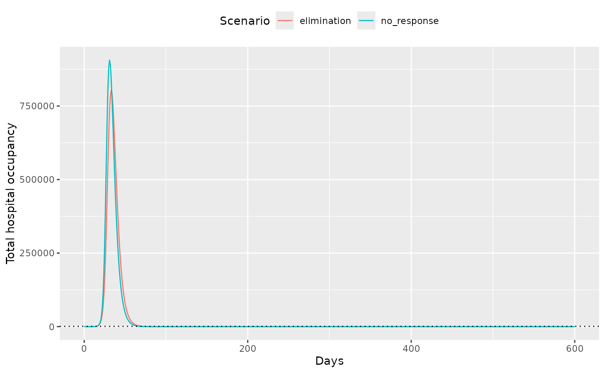

# Modelling threshold-dependent economic closures

``` r
library(daedalus)
library(data.table)
library(ggplot2)

response_threshold <- 1000
```

Initially run the model with no response, and then with an elimination
response activated when total hospitalisations reach 1000 or after 30
days, whichever is sooner.

``` r
canada <- daedalus_country("CAN")
canada$hospital_capacity <- response_threshold

data_baseline <- daedalus(
  canada,
  daedalus_infection("influenza_1918", rho = 0.0), # prevent re-infection
  response_strategy = "none"
)

# get the model timeseries
data_baseline <- get_data(data_baseline)
data_baseline$scenario <- "no_response"
```

``` r
# run the model with a heavy elimination intervention
data_intervention <- daedalus(
  canada,
  daedalus_infection("influenza_1918", rho = 0.0), # prevent re-infection
  response_strategy = "elimination"
)

# get the model timeseries
data_intervention <- get_data(data_intervention)
data_intervention$scenario <- "elimination"
```

**Note that** the default duration of a pandemic response in *daedalus*
is 365 days. This duration applies from the time of the first response
trigger. That is, if a model is set up such that a response is mandated
from day 30, the response will end on day `30 + 365 =` 395 by default.

However, if the response begins earlier than the `response_time` due to
hospital capacity being breached, the duration applies from this earlier
time. In this scenario, the start and end times of the response can only
be known by running the model. The response duration will still be the
value passed to `response_duration` (or the default if no specific value
is passed).

Plot the total hospital occupancy for both scenarios to view the effect
of interventions.

``` r
data <- rbindlist(list(data_baseline, data_intervention))
```

``` r
# sum over age and econ strata as total is more relevant
data <- data[compartment == "hospitalised", .(value = sum(value)),
  by = c("time", "compartment", "scenario")
]

# check actual outcomes of interest - these don't look as good
ggplot(data) +
  geom_line(aes(time, value, colour = scenario)) +
  geom_hline(
    yintercept = response_threshold, linetype = "dotted"
  ) +
  labs(y = "Total hospital occupancy", x = "Days", col = "Scenario") +
  theme(legend.position = "top")
```



**Note that** the effect of response strategies that introduce closures
does not appear to be very large — this is because the full range of
interventions associated with each strategy is yet to be implemented.
